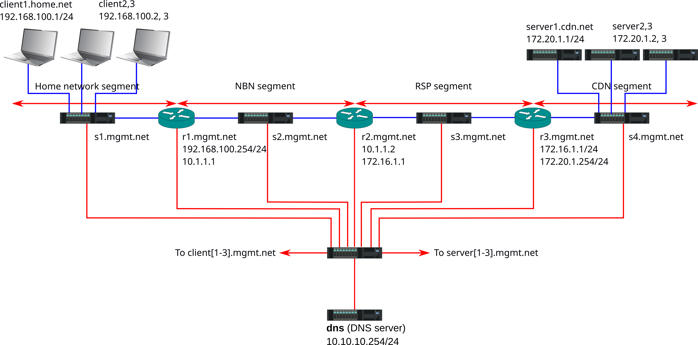

# NBN Testbed

This repository contains a Mininet implementation of a simplified model of a broadband service delivered via by a retail service provider over Australia's National Broadband Network.

{width=100%}

## Network Overview

The customer network is 192.168.100.0/24, consisting of three client nodes, client1 (192.168.100.1), client2 (192.168.100.2) and client3 (192.168.100.3) plus a gateway r1 (192.168.100.254) all connected together (for now) by an Ethernet switch s1.

The gateway r1 is connected to the RSP via a layer 2 service (the NBN segment); the endpoint on the gateway is 10.1.1.1 and the RSP endpoint is 10.1.1.2. In between these, we have one switch (s2) which emulates the NBN connection. This will progressively be built into a more interesting model over time.

The RSP internal network (internally connected via switch s4) is 172.16.1.0/24 (the 2nd interface on the RSP-customer gateway r2 is 172.16.1.1). The internet-facing router in the RSP network, r3, is 172.16.1.254; it is connected to a CDN (172.20.1.0/24) via a 2nd interface (172.20.1.254). In the CDN (which is interconnected by switch s4) there are three servers: server1 (172.20.1.1), server2 (172.20.1.2) and server3 (172.20.1.3).

A DNS server provides forward and reverse DNS services. It, together with all nodes previously listed (clients, routers, switches and servers) are connected to a management switch (sm), and can be logged into outside of the test segments via sm by name (e.g. r1.mgmt.net). Within the test segments, the different sections of the network have distinct domain names: home.net, nbn.net, rsp.net and cdn.net. The search path gives preference to these domains.

Note: we are currently not doing any sort of NAT or CGNAT (this may be added later, it won't affect the function of the network for the purposes of this model). Similarly, we are not modelling the VLAN etc. used to identify the retail service over the L2 NBN service.

## Getting Started

**Video Tutorial Available**: A complete walkthrough of this setup process has been recorded and can be viewed at: https://drive.google.com/file/d/1q0LnVuSv4uqEVbTSCl69eytOM-iKzcsA/view?usp=sharing

# Network Simulation Setup Guide

This document provides step-by-step instructions for setting up and running the PDD8_Test network simulation environment.

## Prerequisites

- **Intel-based host machine** (required for VM compatibility)
- VMware Workstation Pro
- At least 8GB RAM (16GB+ recommended)
- 50GB+ free disk space
- Internet connection
- **Repository access** (see Access Requirements below)

## Access Requirements

Before proceeding with the setup, you must request access to the repository from:

**Dr. Duc Minh Pham**  
Postdoctoral Research Fellow  
Engineering & Information Technology, UTS  
Email: Duc.Pham@uts.edu.au

Please contact Dr. Pham to obtain access permissions for the peak detection network simulation framework.

## Initial Setup

### 1. VMware Workstation Pro Installation

Download and install VMware Workstation Pro on your host machine:

1. Download VMware Workstation Pro from the official VMware website
2. Follow the installation instructions for your operating system
3. Obtain a license key or use the trial version

### 2. VM Image Setup

Download and import the pre-configured VM image:

1. **Download the VM image** from: https://drive.google.com/file/d/1AWq76TuNiIa8a1ye0hNP-pVur-0aVb3G/view
2. **Extract the downloaded file** (if compressed)
3. **Import into VMware**:
   - Open VMware Workstation Pro
   - Go to File → Open
   - Navigate to the downloaded VM image file
   - Follow the import wizard

⚠️ **Important**: This VM image is compatible only with Intel chip host machines.

### 3. VM Configuration

Before starting the VM, ensure adequate resources:

- **RAM**: Allocate at least 4GB (8GB recommended)
- **CPU**: Assign 2+ cores
- **Network**: Ensure VM has network connectivity

Start the VM and proceed with the following setup instructions.

## Setup Instructions

### 1. SSH Key Configuration

First, configure SSH keys for local testing:

```bash
# Switch to root user
sudo bash

# Generate SSH key pair
ssh-keygen

# Add public key to authorized keys
cat ~/.ssh/id_ed25519.pub >> ~/.ssh/authorized_keys

# Set proper permissions for SSH directory and files
chmod 700 /root/.ssh
chmod 600 /root/.ssh/config
chown -R root:root /root/.ssh

# Test SSH connection locally
sudo ssh root@localhost
```

After testing, close the terminal.

### 2. Project Setup

Navigate to your Desktop and clone the repository:

```bash
cd Desktop
git clone https://github.com/ducminh79/peak_detection.git
```

### 3. System Dependencies Installation

Install required system packages:

```bash
sudo apt update
sudo apt install python3-pyroute2 python3-setuptools python3-pip python3.13-venv d-itg
```

### 4. Project Configuration

Navigate to the project directory and set up the environment:

```bash
cd peak_detection

# Make the main script executable
sudo chmod +x nbn_testbed.py

# Create Python virtual environment
python3 -m venv .venv

# Activate virtual environment
source .venv/bin/activate

# Install Python dependencies
pip install -r requirements.txt

```
**Note:** For Windows with GPU, please install torch and torchvision with appropriate CUDA version at: https://pytorch.org/get-started/locally

### 5. Performance Monitoring Setup

Configure the performance monitoring tools:

```bash
cd perfmon

# Make the monitoring script executable
sudo chmod +x simultaneous_capture_trafgen.py

# Generate test configuration files (single test case by default)
python3 generate_test_streaming_csv.py

# To generate multiple test cases, use:
# python3 generate_test_streaming_csv.py --csv test_cases.csv
```

**Note:** This command will create:
- A `test_configs` folder in the perfmon directory
- A single sample test case JSON file (by default)
- For multiple test cases, use the `--csv test_cases.csv` option

### 6. Running the Network Simulation

Return to the main project directory and execute the simulation:

```bash
cd ../
sudo ./nbn_testbed.py --households 32 --clients-per-household 2 --servers 16
```

## Expected Output

When the experiment runs successfully:

1. **Log Files**: Two log files will be generated in the `perfmon` folder with live network data
2. **File Movement**: Upon completion, the JSON configuration file from `test_configs` folder will be automatically moved to the `completed_experiments` folder
3. **Live Data**: Monitor the log files to verify they are receiving live network data during the experiment

## Data Analysis and Visualization

### 7. Organizing Experiment Data

After running experiments, organize the generated log files:

```bash
# Create the raw_data directory structure
mkdir -p raw_data

# Create a subfolder for your experiment (use any descriptive name)
mkdir raw_data/experiment_1

# Move the generated log files from perfmon to the organized structure
mv perfmon/*.log raw_data/experiment_1/
```

**Alternative**: If you don't want to run experiments, you can download pre-existing data:
- Download the default raw_data folder from: https://drive.google.com/drive/folders/1QbUSpK3XAJjQWud6t97vgc99hekJdsOX?usp=sharing
- Extract and place it in the peak_detection directory

### 8. Running Data Analysis Pipeline

Execute the machine learning analysis pipeline:

```bash
# Ensure you're in the main peak_detection directory and virtual environment is activated
python3 analysis/pipeline.py
```

This command will process the data from the `raw_data` folder and train machine learning models.

### 9. Launching the Streamlit Dashboard

After the pipeline completes, start the interactive dashboard:

```bash
streamlit run analysis/app_v1.py
```

This will open a web-based interface for visualizing and analyzing your network simulation results.

## Verification Steps

To confirm the setup is working correctly:

1. **Check log files**: Verify that log files in `perfmon/` are being updated with live data during the experiment
2. **Monitor file movement**: Confirm that configuration files move from `test_configs/` to `completed_experiments/` after completion
3. **Review experiment results**: Analyze the generated logs and completed experiment data
4. **Verify data organization**: Ensure log files are properly moved to `raw_data/` subfolders
5. **Test analysis pipeline**: Confirm the `analysis/pipeline.py` runs without errors
6. **Check dashboard**: Verify the Streamlit app launches and displays data correctly

## Troubleshooting

- **SSH Issues**: Ensure SSH service is running and keys are properly configured
- **Permission Errors**: Verify all scripts have execute permissions and you're running with appropriate privileges
- **Python Environment**: Make sure the virtual environment is activated before running Python scripts
- **Missing Dependencies**: Double-check that all system packages are installed correctly

## File Structure

```
peak_detection/
├── nbn_testbed.py          # Main simulation script
├── requirements.txt        # Python dependencies
├── perfmon/
│   ├── simultaneous_capture_trafgen.py
│   ├── generate_test_streaming_csv.py
│   ├── test_configs/       # Generated test configurations
│   └── completed_experiments/  # Completed test results
├── raw_data/              # Organized experiment data
│   └── experiment_1/      # Subfolder containing log files
├── analysis/
│   ├── pipeline.py        # Data analysis and ML pipeline
│   └── app.py            # Streamlit dashboard application
└── .venv/                # Python virtual environment
```

## Notes

- Always run the main simulation with sudo privileges
- Ensure the virtual environment is activated when running Python scripts
- Monitor system resources during large-scale simulations (20+ servers/clients)
- Log files provide real-time feedback on network performance metrics
- Organize experiment data in the `raw_data` directory for systematic analysis
- The analysis pipeline requires the log files to be properly organized in subfolders
- Streamlit dashboard provides interactive visualization of experiment results
